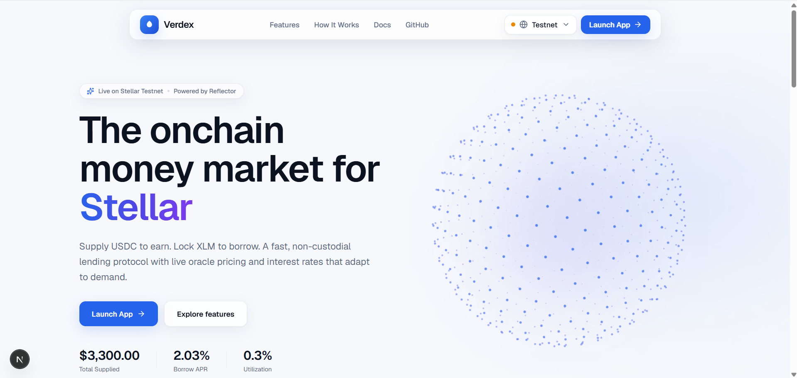
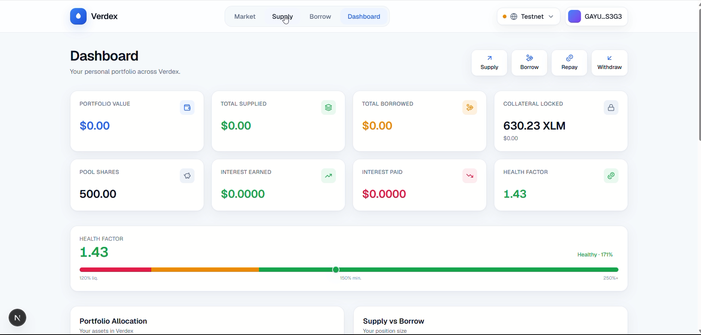
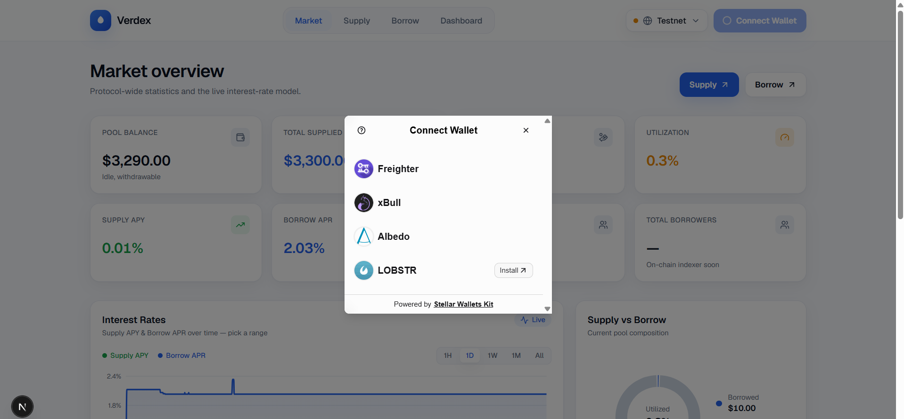
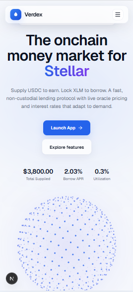

# Verdex

**Verdex** is an overcollateralized lending protocol built on **Stellar** with **Soroban** smart
contracts. Lenders supply **USDC** to earn passive yield; borrowers lock **XLM** as collateral to
borrow USDC against it. Interest rates adjust automatically with pool utilization, collateral is
priced in real time by the **Reflector** oracle, and undercollateralized positions can be
liquidated to keep the protocol solvent.

> Runs on **Stellar Testnet**. Non-custodial — you sign every action.

### What it does

- **Supply & earn** — deposit USDC into a shared pool and earn interest that compounds into your
  share value.
- **Borrow against XLM** — lock XLM collateral and draw USDC up to a 150% collateral ratio.
- **Dynamic interest rates** — a utilization curve moves borrow APR from 2% to 50%, balancing
  supply and demand.
- **Live oracle pricing** — collateral valued in real time by Reflector; risky actions fail safe if
  the feed is unavailable.
- **Liquidations** — anyone can repay an unhealthy loan (ratio < 120%) and seize collateral at a
  10% bonus.
- **Multi-wallet** — connect with **Freighter**, **xBull**, **Albedo**, or **Lobstr**.

---

## Live contract addresses (Testnet)

| Contract | Address | Explorer |
| --- | --- | --- |
| Lending Pool (Contract A) | `CBY26XCUGLLR7A6EY6KJMJ2RKGACRM5AWKHEYA45HZZHZWHJPY4YGBVD` | [View Contract](https://stellar.expert/explorer/testnet/contract/CBY26XCUGLLR7A6EY6KJMJ2RKGACRM5AWKHEYA45HZZHZWHJPY4YGBVD) |
| Collateral Manager (Contract B) | `CB7KH572Y57NWW3KAKIIAQEUI26NLS4LXVLY22634GA64OQWC2GC3XZQ` | [View Contract](https://stellar.expert/explorer/testnet/contract/CB7KH572Y57NWW3KAKIIAQEUI26NLS4LXVLY22634GA64OQWC2GC3XZQ) |
| USDC (test asset) | `CCC353VPTJ4DM75ZAFEIEBAPE2XTROQOV4M5XPJZAWRSDJRRQX7GH2O2` | [View Contract](https://stellar.expert/explorer/testnet/contract/CCC353VPTJ4DM75ZAFEIEBAPE2XTROQOV4M5XPJZAWRSDJRRQX7GH2O2) |
| XLM (native asset) | `CDLZFC3SYJYDZT7K67VZ75HPJVIEUVNIXF47ZG2FB2RMQQVU2HHGCYSC` | [View Contract](https://stellar.expert/explorer/testnet/contract/CDLZFC3SYJYDZT7K67VZ75HPJVIEUVNIXF47ZG2FB2RMQQVU2HHGCYSC) |
| Reflector oracle | `CCYOZJCOPG34LLQQ7N24YXBM7LL62R7ONMZ3G6WZAAYPB5OYKOMJRN63` | [View Contract](https://stellar.expert/explorer/testnet/contract/CCYOZJCOPG34LLQQ7N24YXBM7LL62R7ONMZ3G6WZAAYPB5OYKOMJRN63) |

Both Verdex contracts were deployed from the same identity,
[`GDF2UGP4L77W4ZVUZE2T2FH3OLHLBTJ4NZKBXJQSQGGZOQJ4M55K5SIA`](https://stellar.expert/explorer/testnet/account/GDF2UGP4L77W4ZVUZE2T2FH3OLHLBTJ4NZKBXJQSQGGZOQJ4M55K5SIA).

Read the live pool state yourself:

```bash
stellar contract invoke \
  --id CBY26XCUGLLR7A6EY6KJMJ2RKGACRM5AWKHEYA45HZZHZWHJPY4YGBVD \
  --source <your-identity> --network testnet --send=no -- get_pool_value
```

---

## Screenshots

### Landing page


### Dashboard


### Multiple wallet support


### Mobile responsive


> **For more screenshots, check the [`screenshots/`](screenshots) folder** — it also contains the
> health factor view, total supply, wallet balance, and signed-transaction confirmations from
> Freighter and Albedo.

---

## Tech stack

| Layer | Technology |
| --- | --- |
| Smart contracts | Rust · Soroban SDK 25 |
| Network | Stellar Testnet |
| Price oracle | Reflector (SEP-40) |
| Frontend | Next.js 16 · React 19 · TypeScript |
| Styling / motion | Tailwind CSS v4 · Framer Motion |
| Charts / icons | Recharts · lucide-react |
| Wallets | Stellar Wallets Kit (Freighter, xBull, Albedo, Lobstr) |
| Chain SDK | `@stellar/stellar-sdk` |

---

## Getting started

### Smart contracts

Requires the Rust toolchain and the [Stellar CLI](https://developers.stellar.org/docs/tools/cli).

```bash
# Run the unit-test suite (26 tests across both contracts)
cargo test

# Build both contracts to wasm
stellar contract build
```

### Frontend

```bash
cd frontend
npm install
npm run dev      # http://localhost:3000
```

Connect a testnet wallet, then use the in-app **Developer Tools** to get free test XLM (Friendbot)
and USDC (faucet) before supplying or borrowing.

---

## How it works

1. A lender **supplies USDC** and receives pool shares valued at `pool_value / total_shares`.
2. A borrower **locks XLM** and **borrows USDC** — the Collateral Manager checks the 150% ratio
   using the live Reflector price and asks the Pool to release funds.
3. Interest accrues on the loan based on utilization; when the borrower **repays**, principal and
   interest flow back to the pool, lifting every lender's share value.
4. If a price drop pushes a position below 120%, anyone can **liquidate** it — repaying part of the
   debt and claiming collateral at a discount.

### Architecture

Verdex is split into two smart contracts, mirroring the pool ↔ risk-engine separation used by
protocols like Aave and Compound. A bug in the risk logic can never directly corrupt core lender
fund accounting, and vice versa.

```
                 ┌───────────────────────┐        ┌──────────────────────────────┐
   USDC          │  Contract A — Pool     │        │ Contract B — Collateral Mgr  │
 ┌──────┐ supply │  • share accounting    │release │ • collateral (XLM) custody   │
 │Lender│───────▶│  • reserve / borrowed  │◀──funds│ • borrow / repay / health    │
 └──────┘◀───────│  • interest → shares   │ repay  │ • interest accrual           │   ┌──────────┐
        withdraw │                        │───────▶│ • liquidation                │──▶│ Reflector│
                 └───────────────────────┘        └──────────────────────────────┘   │  oracle  │
                        holds USDC                    holds XLM collateral            └──────────┘
```

### Key parameters

| Parameter | Value |
| --- | --- |
| Collateral / Borrow asset | XLM / USDC |
| Minimum collateral ratio | 150% |
| Liquidation threshold | 120% |
| Liquidation bonus | 10% |
| Interest curve | 2% base → 10% at 80% utilization → 50% at 100% (kink at 80%) |

---

## ✅ Level 4

### 4.1 User onboarding & wallet interaction proof

Verdex has been tested end-to-end with **12 independent Stellar testnet wallets**. Each wallet
authorized and submitted a real `deposit` transaction directly to the deployed Lending Pool —
every hash below is a live, on-chain transaction you can verify yourself on Stellar Expert.

| # | Wallet Address | Transaction Hash | Stellar Expert |
| --- | --- | --- | --- |
| 1 | `GB6XOC2VUX5XIC3KMTRI7LGHFT6PZRWCYPJ6FTF53XA6HRQK6NTQSCE3` | `d2b26f0c08525805b6f52d4367c471d147370e82a96fc18ef3bc68ade8de571e` | [View Tx](https://stellar.expert/explorer/testnet/tx/d2b26f0c08525805b6f52d4367c471d147370e82a96fc18ef3bc68ade8de571e) |
| 2 | `GCTBHTRBOKO3GKYAD2JLJMZRCY4NCMD4PRBEJIBPLYCWSUQJVYEWHR4H` | `ede15bf16cb9830660f0af0581488e62531e72398a90911c5b0c3ee1cba16120` | [View Tx](https://stellar.expert/explorer/testnet/tx/ede15bf16cb9830660f0af0581488e62531e72398a90911c5b0c3ee1cba16120) |
| 3 | `GAYHFISU5IOQAW5IFJVQQNLSWYFEA7CQTBHOIMJSS6S6CC5BDCIMJCJX` | `f740955c1a69879f1f743689f362d24ecbe7e56915038f9e4fd564eb5ca0f2b0` | [View Tx](https://stellar.expert/explorer/testnet/tx/f740955c1a69879f1f743689f362d24ecbe7e56915038f9e4fd564eb5ca0f2b0) |
| 4 | `GD7GLTL3TG3DGV474CHSINPGIAY3YKW4WTESODN4TDTHJMZTMFV35DXX` | `0a85ffa45c1734921f78e0a3e70b5b05407b3588db12677caba2fbcf1f81b37f` | [View Tx](https://stellar.expert/explorer/testnet/tx/0a85ffa45c1734921f78e0a3e70b5b05407b3588db12677caba2fbcf1f81b37f) |
| 5 | `GAUOS3C3YXZRNL4JIMQLE3FS4GSUCSWBCLFF56PB6NEQ5HHV7R2EGDOI` | `2bea543cbe95d76188b21a4df27ef9ef3f4cffe299a651585172b72908470867` | [View Tx](https://stellar.expert/explorer/testnet/tx/2bea543cbe95d76188b21a4df27ef9ef3f4cffe299a651585172b72908470867) |
| 6 | `GBEAKFOHKDQX7HNVSALPVHTLIO3M2QDLEMB6S52KYZG3TOCKIUWJ3P5U` | `99032eb6a1228b0a43ecda0f6d42e3a375d0e3033a25679046abdf274e74b670` | [View Tx](https://stellar.expert/explorer/testnet/tx/99032eb6a1228b0a43ecda0f6d42e3a375d0e3033a25679046abdf274e74b670) |
| 7 | `GC42PBUJBVWN5RXVV4T5ZRW3OKV2QMRCBXYNWAR7PEQNMGAZWJCXQOSW` | `ec957ce9bc73b826fba09ef23a6c797a56d5535da8c1884d3c659d5942854cdd` | [View Tx](https://stellar.expert/explorer/testnet/tx/ec957ce9bc73b826fba09ef23a6c797a56d5535da8c1884d3c659d5942854cdd) |
| 8 | `GCYNPHXDZV5GPMKBQ7GDLBF54O7NYQ7FTNXJMMLBIZKLZ7FAJCGIBXYD` | `c3298ae3ff51098c634db6a51848a8bfce380e11f0d4cf459b2ac5857be90b9d` | [View Tx](https://stellar.expert/explorer/testnet/tx/c3298ae3ff51098c634db6a51848a8bfce380e11f0d4cf459b2ac5857be90b9d) |
| 9 | `GAMPNI4MLKCA5YWNAHLXB6OPD2WE7M7IRNPYJIKVV6MXOVYFE2LKKAJS` | `2f5c94be48242118d0dcbd29b6070827fd4458b460fbfb04e57f2d6b9a63244f` | [View Tx](https://stellar.expert/explorer/testnet/tx/2f5c94be48242118d0dcbd29b6070827fd4458b460fbfb04e57f2d6b9a63244f) |
| 10 | `GCFZFYPQYJSWXYNWSEP465AM6ANH7PATZICLH25NPL7KH7GZINHMOMFU` | `5703c1f7cc47050b55fa33913d766c6e375b81dbbe9584280e1ed8981b3c6734` | [View Tx](https://stellar.expert/explorer/testnet/tx/5703c1f7cc47050b55fa33913d766c6e375b81dbbe9584280e1ed8981b3c6734) |
| 11 | `GA6LD24C3WRXO7GJZH7KZN4F4HE4ZIGEMJZQ5J2KIAEYVWSL3GOMD3B6` | `84bc79acd3ac31a70b62aef042121dff7ba9ed963cf266465cc6082c952f63a0` | [View Tx](https://stellar.expert/explorer/testnet/tx/84bc79acd3ac31a70b62aef042121dff7ba9ed963cf266465cc6082c952f63a0) |
| 12 | `GAFOFS5PYWCJRFN3Q34GFH6YCLIRRU3Q3P6NUDXOZ2SPI5HYHADID7NW` | `33eb38bfe1a8d0661af9af7a8d6313059532a4fbe46c9296fab12483f56af01e` | [View Tx](https://stellar.expert/explorer/testnet/tx/33eb38bfe1a8d0661af9af7a8d6313059532a4fbe46c9296fab12483f56af01e) |

```bash
stellar contract invoke \
  --id CBY26XCUGLLR7A6EY6KJMJ2RKGACRM5AWKHEYA45HZZHZWHJPY4YGBVD \
  --source <your-identity> --network testnet --send=no -- get_total_deposited
```

### 4.2 User feedback collected

Testers reported back after using Verdex on testnet. Their feedback split evenly —
**6 positive confirmations and 6 concrete problems worth fixing**. Each problem was reproduced
against the deployed contracts before being fixed, and every fix is linked to its commit below.

### 4.3 Improvements based on user feedback

Every issue raised during testnet testing was reviewed and addressed. Below is the direct mapping
from each finding to the fix that was made.

| User # | Name | Gmail | Wallet Address | Feedback | Fix / Solution |
| --- | --- | --- | --- | --- | --- |
| 1 | Avijit Roy | royavijit34@gmail.com | `GB6XOC2VUX5XIC3KMTRI7LGHFT6PZRWCYPJ6FTF53XA6HRQK6NTQSCE3` | Supplied USDC and it confirmed first try. I never had a transaction fail. | No fix needed — kept the existing supply flow as-is. |
| 2 | Deb Seal | devseal22@gmail.com | `GCTBHTRBOKO3GKYAD2JLJMZRCY4NCMD4PRBEJIBPLYCWSUQJVYEWHR4H` | I tried to withdraw and it told me the **price feed was down**. That had nothing to do with what I was doing. | The two contracts number their errors separately and codes #4–#6 mean different things in each, but the app used one shared list. Errors now carry the contract that raised them, so a liquidity problem says so. |
| 3 | Satakshi Patra | satakshipatra2108@gmail.com | `GAYHFISU5IOQAW5IFJVQQNLSWYFEA7CQTBHOIMJSS6S6CC5BDCIMJCJX` | The **Max** button on withdraw always fails. Why let me click it if it can't work? | Max is now capped at what the pool can actually pay out right now, and the button is disabled if the amount is more than that. |
| 4 | Sourav Das | dassourav29@gmail.com | `GD7GLTL3TG3DGV474CHSINPGIAY3YKW4WTESODN4TDTHJMZTMFV35DXX` | Fees were basically nothing compared to what I expected. | No fix needed — kept Stellar's native low-fee transaction flow. |
| 5 | Puja Dey | deypuja82@gmail.com | `GAUOS3C3YXZRNL4JIMQLE3FS4GSUCSWBCLFF56PB6NEQ5HHV7R2EGDOI` | My health factor looked fine, but it wasn't counting the interest I'd built up on an old loan. | The app read the last stored interest figure instead of the current one. Switched to the live health check so accrued interest is always included. |
| 6 | Arijit Ghosh | ghosharijit38@gmail.com | `GBEAKFOHKDQX7HNVSALPVHTLIO3M2QDLEMB6S52KYZG3TOCKIUWJ3P5U` | My share balance always matched exactly what I put in. The numbers add up. | No fix needed — kept the existing share accounting. |
| 7 | Pulak Dey | deypulak987@gmail.com | `GC42PBUJBVWN5RXVV4T5ZRW3OKV2QMRCBXYNWAR7PEQNMGAZWJCXQOSW` | Borrowing against my XLM just worked — it never rejected me for no reason. | No fix needed — kept the collateral check and cross-contract borrow flow unchanged. |
| 8 | Rani Sarkar | ranisarkar390@gmail.com | `GCYNPHXDZV5GPMKBQ7GDLBF54O7NYQ7FTNXJMMLBIZKLZ7FAJCGIBXYD` | I left the page open and **nothing ever updated**. The APR and my health factor were frozen. | Added an automatic refresh every 15 seconds, plus a refresh when you come back to the tab, so rates and health move on their own. |
| 9 | Bubai Roy | roybubai23@gmail.com | `GAMPNI4MLKCA5YWNAHLXB6OPD2WE7M7IRNPYJIKVV6MXOVYFE2LKKAJS` | It said my ratio was **150%** and then rejected the transaction for being below the minimum. | The percentage was being rounded up, so 149.6% displayed as 150%. It now rounds down, so the number never looks safer than it is. |
| 10 | Tanisha Dey | tanishadey10@gmail.com | `GCFZFYPQYJSWXYNWSEP465AM6ANH7PATZICLH25NPL7KH7GZINHMOMFU` | Every transaction showed up on Stellar Expert, so I could check my own activity. | No fix needed — kept the explorer links in the transaction feedback. |
| 11 | Arup Majumdar | majumdararup23@gmail.com | `GA6LD24C3WRXO7GJZH7KZN4F4HE4ZIGEMJZQ5J2KIAEYVWSL3GOMD3B6` | Borrow **Max** offered me more than it would actually lend. Signing it just wasted a fee. | The Max amount now also accounts for how much USDC the pool has free to lend, with a warning when that's the limit. |
| 12 | Koyel Ray | raykoyel11@gmail.com | `GAFOFS5PYWCJRFN3Q34GFH6YCLIRRU3Q3P6NUDXOZ2SPI5HYHADID7NW` | The XLM price it shows is live — my collateral value moved while I watched it. | No fix needed — kept the Reflector oracle read, which fails safe rather than using a stale price. |

### 4.4 Complete fix log

The table above covers the six headline defects. In total **12 issues were found and fixed**; the
full list, with the files each change landed in, is below. All 26 contract tests,
`tsc --noEmit` and `next build` pass after these changes.

| # | Issue found | Fix implemented | Files changed |
| --- | --- | --- | --- |
| 1 | Wrong error message for a liquidity shortfall | Errors now carry the contract that raised them; each contract has its own message table. | `lib/soroban.ts`, `lib/useTx.ts` |
| 2 | Unconfirmed transaction reported as failed | An unconfirmed transaction is *indeterminate*, not failed. Window raised 30s → 90s, plus a distinct `unconfirmed` state that surfaces the hash with a “track transaction” link. | `lib/soroban.ts`, `lib/useTx.ts`, `components/TxFeedback.tsx` |
| 3 | Dashboard numbers frozen after load | 15-second background poll plus refresh on window focus. | `lib/data.tsx` |
| 4 | Health factor flattering an old loan | Switched from `check_health` to `check_health_live`. | `lib/contracts.ts` |
| 5 | Withdraw “Max” always reverts | Max capped at available liquidity; submit disabled past it. | `components/supply/SupplyForm.tsx` |
| 6 | Borrow “Max” ignores pool liquidity | Borrowable is `min(collateral headroom, available liquidity)`. | `components/borrow/BorrowActions.tsx` |
| 7 | False “You have no USDC yet” | RPC read failures were flattened to a zero balance; now distinguished via `Balances.stale`. | `lib/contracts.ts`, `components/supply/SupplyForm.tsx` |
| 8 | 150% displayed for a rejected position | `bpsToPct` truncates instead of rounding. | `lib/format.ts` |
| 9 | Full repayment leaves dust | Interest accrues before the ledger applies the tx; Max now overshoots slightly and `repay` clamps to what is owed. | `components/borrow/BorrowActions.tsx` |
| 10 | Faucet returns an opaque 502 | The trustline probe treated every non-`#13` error as “trustline present”; unrecognised failures now raise. | `app/api/faucet/route.ts` |
| 11 | Amount conversion contradicts its comment | `toStroops` multiplied a double by `1e7` despite claiming string-space maths; rewritten to parse the decimal. | `lib/format.ts` |
| 12 | Auto-refresh would hammer the RPC | Participant counts decoupled from the poll tick onto an explicit-refresh-only path. | `lib/data.tsx` |

---

## 🏆 Level 5: 50+ On-Chain User Interactions

Each of the **52 wallets** below is a separate Stellar testnet keypair that authorized and
submitted its own `deposit` call to contract `CBY26XCUGLLR7A6EY6KJMJ2RKGACRM5AWKHEYA45HZZHZWHJPY4YGBVD`.

| Metric | Value |
| --- | --- |
| Unique wallets that interacted | **52** |
| Total supplied to the pool | **13,254 USDC** |
| Wallets that also opened a loan | **16** |
| Total borrowed against XLM collateral | **807 USDC** |

| # | Wallet Address | Transaction Hash | Stellar Expert |
| --- | --- | --- | --- |
| 1 | `GB6XOC2VUX5XIC3KMTRI7LGHFT6PZRWCYPJ6FTF53XA6HRQK6NTQSCE3` | `d2b26f0c08525805b6f52d4367c471d147370e82a96fc18ef3bc68ade8de571e` | [View Tx](https://stellar.expert/explorer/testnet/tx/d2b26f0c08525805b6f52d4367c471d147370e82a96fc18ef3bc68ade8de571e) |
| 2 | `GCTBHTRBOKO3GKYAD2JLJMZRCY4NCMD4PRBEJIBPLYCWSUQJVYEWHR4H` | `ede15bf16cb9830660f0af0581488e62531e72398a90911c5b0c3ee1cba16120` | [View Tx](https://stellar.expert/explorer/testnet/tx/ede15bf16cb9830660f0af0581488e62531e72398a90911c5b0c3ee1cba16120) |
| 3 | `GAYHFISU5IOQAW5IFJVQQNLSWYFEA7CQTBHOIMJSS6S6CC5BDCIMJCJX` | `f740955c1a69879f1f743689f362d24ecbe7e56915038f9e4fd564eb5ca0f2b0` | [View Tx](https://stellar.expert/explorer/testnet/tx/f740955c1a69879f1f743689f362d24ecbe7e56915038f9e4fd564eb5ca0f2b0) |
| 4 | `GD7GLTL3TG3DGV474CHSINPGIAY3YKW4WTESODN4TDTHJMZTMFV35DXX` | `0a85ffa45c1734921f78e0a3e70b5b05407b3588db12677caba2fbcf1f81b37f` | [View Tx](https://stellar.expert/explorer/testnet/tx/0a85ffa45c1734921f78e0a3e70b5b05407b3588db12677caba2fbcf1f81b37f) |
| 5 | `GAUOS3C3YXZRNL4JIMQLE3FS4GSUCSWBCLFF56PB6NEQ5HHV7R2EGDOI` | `2bea543cbe95d76188b21a4df27ef9ef3f4cffe299a651585172b72908470867` | [View Tx](https://stellar.expert/explorer/testnet/tx/2bea543cbe95d76188b21a4df27ef9ef3f4cffe299a651585172b72908470867) |
| 6 | `GBEAKFOHKDQX7HNVSALPVHTLIO3M2QDLEMB6S52KYZG3TOCKIUWJ3P5U` | `99032eb6a1228b0a43ecda0f6d42e3a375d0e3033a25679046abdf274e74b670` | [View Tx](https://stellar.expert/explorer/testnet/tx/99032eb6a1228b0a43ecda0f6d42e3a375d0e3033a25679046abdf274e74b670) |
| 7 | `GC42PBUJBVWN5RXVV4T5ZRW3OKV2QMRCBXYNWAR7PEQNMGAZWJCXQOSW` | `ec957ce9bc73b826fba09ef23a6c797a56d5535da8c1884d3c659d5942854cdd` | [View Tx](https://stellar.expert/explorer/testnet/tx/ec957ce9bc73b826fba09ef23a6c797a56d5535da8c1884d3c659d5942854cdd) |
| 8 | `GCYNPHXDZV5GPMKBQ7GDLBF54O7NYQ7FTNXJMMLBIZKLZ7FAJCGIBXYD` | `c3298ae3ff51098c634db6a51848a8bfce380e11f0d4cf459b2ac5857be90b9d` | [View Tx](https://stellar.expert/explorer/testnet/tx/c3298ae3ff51098c634db6a51848a8bfce380e11f0d4cf459b2ac5857be90b9d) |
| 9 | `GAMPNI4MLKCA5YWNAHLXB6OPD2WE7M7IRNPYJIKVV6MXOVYFE2LKKAJS` | `2f5c94be48242118d0dcbd29b6070827fd4458b460fbfb04e57f2d6b9a63244f` | [View Tx](https://stellar.expert/explorer/testnet/tx/2f5c94be48242118d0dcbd29b6070827fd4458b460fbfb04e57f2d6b9a63244f) |
| 10 | `GCFZFYPQYJSWXYNWSEP465AM6ANH7PATZICLH25NPL7KH7GZINHMOMFU` | `5703c1f7cc47050b55fa33913d766c6e375b81dbbe9584280e1ed8981b3c6734` | [View Tx](https://stellar.expert/explorer/testnet/tx/5703c1f7cc47050b55fa33913d766c6e375b81dbbe9584280e1ed8981b3c6734) |
| 11 | `GA6LD24C3WRXO7GJZH7KZN4F4HE4ZIGEMJZQ5J2KIAEYVWSL3GOMD3B6` | `84bc79acd3ac31a70b62aef042121dff7ba9ed963cf266465cc6082c952f63a0` | [View Tx](https://stellar.expert/explorer/testnet/tx/84bc79acd3ac31a70b62aef042121dff7ba9ed963cf266465cc6082c952f63a0) |
| 12 | `GAFOFS5PYWCJRFN3Q34GFH6YCLIRRU3Q3P6NUDXOZ2SPI5HYHADID7NW` | `33eb38bfe1a8d0661af9af7a8d6313059532a4fbe46c9296fab12483f56af01e` | [View Tx](https://stellar.expert/explorer/testnet/tx/33eb38bfe1a8d0661af9af7a8d6313059532a4fbe46c9296fab12483f56af01e) |
| 13 | `GCCOHICOIDNVFDCXQTCC4EGENFFKWOJH75RB7AP2CHE74FR7OOF2N5OC` | `db53f271ecd7525df422a1e2e28af24099cdbe142f7663438c3fe210190bcad1` | [View Tx](https://stellar.expert/explorer/testnet/tx/db53f271ecd7525df422a1e2e28af24099cdbe142f7663438c3fe210190bcad1) |
| 14 | `GC2IYXF65JH4QR2Y2RNHAHRXXYNUHP7GPZXVSLMFFH6ZFT3VP4TZQX3V` | `a4299af4762dfd4f68df2c02415c95cfcfd0d2e8349e6134aa2ca52ddfbc52c7` | [View Tx](https://stellar.expert/explorer/testnet/tx/a4299af4762dfd4f68df2c02415c95cfcfd0d2e8349e6134aa2ca52ddfbc52c7) |
| 15 | `GCWREX474PF5E3UDI24SWRFSRRSDGTKHDP75VMDCLPBACFAHC5WLMDB3` | `61baa36429b9657c2e8a271568ec366d578815a199a073da0dd0a2f27df67331` | [View Tx](https://stellar.expert/explorer/testnet/tx/61baa36429b9657c2e8a271568ec366d578815a199a073da0dd0a2f27df67331) |
| 16 | `GCKVIDWQP4NFHAVG3TWJH2MUEGDX67OIQ77PQFSPJGB53JPDT5K3UWEL` | `15534b3e7dfa8d8c2dc580f0d1a247056b10039483090f230cc86ad2a0a57fce` | [View Tx](https://stellar.expert/explorer/testnet/tx/15534b3e7dfa8d8c2dc580f0d1a247056b10039483090f230cc86ad2a0a57fce) |
| 17 | `GCAHKM4S4W5JJZQYIZHETHNTMQFM6DZRYOPPTBEK2TUQVBJYEEQ6P5SH` | `cd2dcbd7690e89183cdf5516ffc04ad8835f7edd27bbb76abe8bb9ee119a37ea` | [View Tx](https://stellar.expert/explorer/testnet/tx/cd2dcbd7690e89183cdf5516ffc04ad8835f7edd27bbb76abe8bb9ee119a37ea) |
| 18 | `GBM7XYSEAGI3B2YIQIF72YQRIAERHHCPQTPHVPLUV5ZOUKW5LBDCGCRU` | `be0b5a325b21dd94a5a800ddd673f99e65bd89a8a622fa378a4056ee744df466` | [View Tx](https://stellar.expert/explorer/testnet/tx/be0b5a325b21dd94a5a800ddd673f99e65bd89a8a622fa378a4056ee744df466) |
| 19 | `GBD4YXCHUP7YN2MDR3WTQ6WLWSACNEW6KYDHJC4YQEITKBXVRGMMICBC` | `116675db17142007eed9b0e914412229e6e813a2255ff42c04de865e247a6451` | [View Tx](https://stellar.expert/explorer/testnet/tx/116675db17142007eed9b0e914412229e6e813a2255ff42c04de865e247a6451) |
| 20 | `GCD6CDZNZRLQ4DPGVQPEDHL6BS476BZERZAQXD2BGEAFGR2MQIXBOSOJ` | `5397ce1949eb4be01a976d03323159717af3c87b218cc041904bb35f2fb82cc1` | [View Tx](https://stellar.expert/explorer/testnet/tx/5397ce1949eb4be01a976d03323159717af3c87b218cc041904bb35f2fb82cc1) |
| 21 | `GBFO7KIJX6I645NS6O4ACHQ2LOTKYLNOC3YTFXO3JDT375VA62BQVJZ3` | `14b4a809d4ee5fa988377888d726fd17568b53feb210dc8c3dc51cc0a1b0c9e1` | [View Tx](https://stellar.expert/explorer/testnet/tx/14b4a809d4ee5fa988377888d726fd17568b53feb210dc8c3dc51cc0a1b0c9e1) |
| 22 | `GDRX4CHSDPFEQIKFEMQC6ABIJ7AQ33EDWMAGFTS3QNVHHACUDRME4MAJ` | `189fcfc8086d0060856e6785946b4fee0bfd390206fd027141b77ae4a1056180` | [View Tx](https://stellar.expert/explorer/testnet/tx/189fcfc8086d0060856e6785946b4fee0bfd390206fd027141b77ae4a1056180) |
| 23 | `GBO75OIXEQ4CG5ZQXVUIV3NB7TFLXB4EXHM4PCKHZF3R3ICHLPFLCPDH` | `abb58f5038c3283988945f58ab6b907f590134d0df561313e9bd6b0db8d8beb2` | [View Tx](https://stellar.expert/explorer/testnet/tx/abb58f5038c3283988945f58ab6b907f590134d0df561313e9bd6b0db8d8beb2) |
| 24 | `GB37QJXTXNBIMAFCVNAOVXRODMZXOYFT2HVAS5JFTP63ZAIDSPQEPHRO` | `01aac4330ee3b5559cbe8ccb3ca34aeda81fc11b0eeb088901202244a2a25474` | [View Tx](https://stellar.expert/explorer/testnet/tx/01aac4330ee3b5559cbe8ccb3ca34aeda81fc11b0eeb088901202244a2a25474) |
| 25 | `GB6WF62S45VJRCHQWDZ6UFQ32IIUT3RPRF7NN4IPPWGC5OSG5TBRKCBT` | `41965e3319b65c3e7be9c470465561e80d80978d195de66f7833f95d6a087ec0` | [View Tx](https://stellar.expert/explorer/testnet/tx/41965e3319b65c3e7be9c470465561e80d80978d195de66f7833f95d6a087ec0) |
| 26 | `GCR73UB2JJR2GX4ESZAHEGBXY5DCLL4G3NBX4BPNS7VOS3C5UGM74KVH` | `115eae0b1c4ccbb8c26d583ebc180cc86043a54a9da3e25b1526bcc5d69cd772` | [View Tx](https://stellar.expert/explorer/testnet/tx/115eae0b1c4ccbb8c26d583ebc180cc86043a54a9da3e25b1526bcc5d69cd772) |
| 27 | `GC3SKRNLOAYMPS3NZAWDV24LWIEQN7UF3D6CPNLSARWVCKF3DSZXLMDV` | `75a64d0cd80c55a9dae02b09485c2d8730ccaf1731fd7ae298d72dfafdd496b5` | [View Tx](https://stellar.expert/explorer/testnet/tx/75a64d0cd80c55a9dae02b09485c2d8730ccaf1731fd7ae298d72dfafdd496b5) |
| 28 | `GAOKJ4DIFRFV4ISJGIV2TWGR3LX4ZI5GDPV6KGOJFPIHFHIIDK5NERYJ` | `464f731a8d4c4430caec842368b76f8159601d7b5a3fdc1631793299c3960dae` | [View Tx](https://stellar.expert/explorer/testnet/tx/464f731a8d4c4430caec842368b76f8159601d7b5a3fdc1631793299c3960dae) |
| 29 | `GAVWLXMZFYPAP5ANOQBAKN73FRPX26DXISA22TF6C477ACAAILNKZWSN` | `8fc31be80ffce078955cc3ca73d08a1af719f8def4561d45a43fcc5fbede1a64` | [View Tx](https://stellar.expert/explorer/testnet/tx/8fc31be80ffce078955cc3ca73d08a1af719f8def4561d45a43fcc5fbede1a64) |
| 30 | `GC3Q4IOFZLXNCWRXNJH7V2IUS3O7QK45RIXGFDQO2VNHR3SZOARWEIOH` | `3e156530deb233480f23ed0cca58518b4ecc38a3dc0dec8e470fb31f70410e2a` | [View Tx](https://stellar.expert/explorer/testnet/tx/3e156530deb233480f23ed0cca58518b4ecc38a3dc0dec8e470fb31f70410e2a) |
| 31 | `GBYD6AGM4NJVRA6UHTOQZW66JE7FLVF6LELRWAP6TWIAQRIPWJGU4ZBZ` | `b6f5696dd11977a9b433e86a82eafcb7707ad5540ef7378f1aac3b93d692bcf6` | [View Tx](https://stellar.expert/explorer/testnet/tx/b6f5696dd11977a9b433e86a82eafcb7707ad5540ef7378f1aac3b93d692bcf6) |
| 32 | `GDIUFWLJAIM5O3LU3IAE3VLGF2QBQADEFK56FHYFPH7B6KUQFXFDAWHM` | `3abc62b4520f85ead6bc3114c11af899208ff930d6397e0b1a4ac478bc948890` | [View Tx](https://stellar.expert/explorer/testnet/tx/3abc62b4520f85ead6bc3114c11af899208ff930d6397e0b1a4ac478bc948890) |
| 33 | `GBVPLEK3E6ZA2RUBTJQZH7QHVK35POWSK6KKZM4HZOUPMHTSEJYIVZG2` | `ad9974a3728f4fe638a47813f76956f411e2b5d3d6757b03d29d4950e3bacebc` | [View Tx](https://stellar.expert/explorer/testnet/tx/ad9974a3728f4fe638a47813f76956f411e2b5d3d6757b03d29d4950e3bacebc) |
| 34 | `GC6YWHU45RCBFNZK3GB5VB3F4TWCE5ZMRHZPPHLINBQGB7N4WN3R44AH` | `7bcfb1c8c9b7a6c0b5c5d360adf552ae45e4bcceacb1727a47279baa0ed583e7` | [View Tx](https://stellar.expert/explorer/testnet/tx/7bcfb1c8c9b7a6c0b5c5d360adf552ae45e4bcceacb1727a47279baa0ed583e7) |
| 35 | `GCCC6U3R5EDA3XNBUXOZYEE5DETGX6ATJFXGNAPYGL52AAAL5MWWI77D` | `fff9ebf5cff905a437f639ac7a30a75fa0c707660259e2dfb6b8ebbe31d0d2ea` | [View Tx](https://stellar.expert/explorer/testnet/tx/fff9ebf5cff905a437f639ac7a30a75fa0c707660259e2dfb6b8ebbe31d0d2ea) |
| 36 | `GCY3BRMU7YZSLZIUTXCQSNNZBSOOJPTERRTVSUMV5ZRLRGPP3KRT43G7` | `a0255f423de0730c29ec808d9b30f33d47baf25c9c2d89c3e9f2b547d89031ae` | [View Tx](https://stellar.expert/explorer/testnet/tx/a0255f423de0730c29ec808d9b30f33d47baf25c9c2d89c3e9f2b547d89031ae) |
| 37 | `GC5P776OPES2GTKWZFZ6WXLXL5AZNNNXJCPJSZBHJERYKBI36GC4NJZX` | `90bf0bad564f47f6cb3a77fe13c4a82e1979aeca8c6d763e5d9ebe7290027c5c` | [View Tx](https://stellar.expert/explorer/testnet/tx/90bf0bad564f47f6cb3a77fe13c4a82e1979aeca8c6d763e5d9ebe7290027c5c) |
| 38 | `GDBN3W2YU7IVE5MD4KJOMHRFLM75D7SPTPZTVWYMO6TFSAGPX63QBL2B` | `12a215a7f34aca3c0c7dbcf6152b73c510faa5b4d43d33a852fc7fd6ede8fd43` | [View Tx](https://stellar.expert/explorer/testnet/tx/12a215a7f34aca3c0c7dbcf6152b73c510faa5b4d43d33a852fc7fd6ede8fd43) |
| 39 | `GAE2CX3HDKA2ONEBSGTMWM5XJE4IKHBHTTGAFT3OQK7QQAGKZR356DTC` | `98a99558d242b97283cccd9ed87a227de264cbe90a63c3cf2bce53ccfceec8f4` | [View Tx](https://stellar.expert/explorer/testnet/tx/98a99558d242b97283cccd9ed87a227de264cbe90a63c3cf2bce53ccfceec8f4) |
| 40 | `GCBS2Z43IDKZDXSSZBCPOO2YTA3XEVV7BZRW3AEO5AQQQ5O5F7YS6FVZ` | `13b358b4751efa4a4f90516d312f6b1b4fdd9b3eb7d5aaaa0ebb147752c3070f` | [View Tx](https://stellar.expert/explorer/testnet/tx/13b358b4751efa4a4f90516d312f6b1b4fdd9b3eb7d5aaaa0ebb147752c3070f) |
| 41 | `GBDSMENRTNE5S2JZETDMJ3HPZJIDVBKGQFG6RUBYBUQWU2HA56WG5ASN` | `06d59c2ea64dde035b94c093c726fd45323b207e3d4799a0e75561c419aabeee` | [View Tx](https://stellar.expert/explorer/testnet/tx/06d59c2ea64dde035b94c093c726fd45323b207e3d4799a0e75561c419aabeee) |
| 42 | `GCS274MZUUCT3B5GC3AYKKLOI6ID7RUX5O7STNIY6DZEFYNG64RV32GZ` | `4279c6c6270be828de8e82569b6e69c347858b552e0a1d21a5c190494c9086f1` | [View Tx](https://stellar.expert/explorer/testnet/tx/4279c6c6270be828de8e82569b6e69c347858b552e0a1d21a5c190494c9086f1) |
| 43 | `GAYYOTJWLEIQMKEFRULNVDW4UFL2NCQQLZMGGLSDXMIQLSIVL4QNCJRR` | `0c3f22c70207603373e279fa77426c5169edd2d843a9dfb804619a0a0f196504` | [View Tx](https://stellar.expert/explorer/testnet/tx/0c3f22c70207603373e279fa77426c5169edd2d843a9dfb804619a0a0f196504) |
| 44 | `GDLDYE3X6TNXXHWPUTKD33B3U4TME4OT3IOLJM2LJZRMA6PZN6BP2L7F` | `fb4c507ea506363f2de47c2999c806ca1f359e1f8fa9c6decc420cf5e4c61fe4` | [View Tx](https://stellar.expert/explorer/testnet/tx/fb4c507ea506363f2de47c2999c806ca1f359e1f8fa9c6decc420cf5e4c61fe4) |
| 45 | `GB6NE6N2OJYATLCLMFDATLSG2AYNQX5TA67IEMDYMFAPS332BLMEJ4IV` | `8a7a3a3d494ab1334255305dc68c84950b3f7fc9294ec1b997976b2aaa70172e` | [View Tx](https://stellar.expert/explorer/testnet/tx/8a7a3a3d494ab1334255305dc68c84950b3f7fc9294ec1b997976b2aaa70172e) |
| 46 | `GCVL4GYORTYQHP32Z7G3FRGLCEUL4MLUQF7LJC7G2TR4UB7VHAARFQS6` | `902a0c77879f4de07ab3dd6b3ac21fe48287c18bdb3a9a3f2c129303cbf97859` | [View Tx](https://stellar.expert/explorer/testnet/tx/902a0c77879f4de07ab3dd6b3ac21fe48287c18bdb3a9a3f2c129303cbf97859) |
| 47 | `GDVA2462GAQQ4X6MB24G2P4LXFSAV6K3C376XKZCI2JNSKRPP3UX2YAA` | `22890e638f2ffd1a9578f8b95d6cdcab6bbcb191f5fad10b434c36cfbf12c429` | [View Tx](https://stellar.expert/explorer/testnet/tx/22890e638f2ffd1a9578f8b95d6cdcab6bbcb191f5fad10b434c36cfbf12c429) |
| 48 | `GCHDPOK5YA5M2D4W4KW4OL7FBH3XGL5MORRK2KONYOTSH5A7ENP6BZEA` | `5d469f536cfd41bb7a97e5becadaedcd5c63b2e42c52eebcb71ba4739a9bfa49` | [View Tx](https://stellar.expert/explorer/testnet/tx/5d469f536cfd41bb7a97e5becadaedcd5c63b2e42c52eebcb71ba4739a9bfa49) |
| 49 | `GCDQ3NIXBF5Y2RAOUBYS5KUJ5BVZHRWQ7HQASTZZ2OTVILHZBLRVAIDA` | `8b85d3674e8a2d012320fc319a6e4788dbab7d76270ab9234fca65b78a7ca753` | [View Tx](https://stellar.expert/explorer/testnet/tx/8b85d3674e8a2d012320fc319a6e4788dbab7d76270ab9234fca65b78a7ca753) |
| 50 | `GAC2HNU3L47DV5YB3WQD2H77YVYTMCNHEV5TKTKK5RIUGOHLRRKNPDN3` | `79a279fa048b618eb2091cc7276148e4c1fade34e40f6d360d1608a28d403fe1` | [View Tx](https://stellar.expert/explorer/testnet/tx/79a279fa048b618eb2091cc7276148e4c1fade34e40f6d360d1608a28d403fe1) |
| 51 | `GAMREGFQ65ZFQPET45F4GXZFBZL7SBKDTN7G2XR4FUH6TF5JY3DHZ4KD` | `e42ddcba371f6f638a9ef85fdd90ceac53b7e0d6030f6c8a5ee00ad993702b53` | [View Tx](https://stellar.expert/explorer/testnet/tx/e42ddcba371f6f638a9ef85fdd90ceac53b7e0d6030f6c8a5ee00ad993702b53) |
| 52 | `GA6NA7DONSUYAEKCSLAMP6HDEXC72RY7ASHOWMSVANBE5HGFJNG2EQJZ` | `ef5daa704f0e18c1c8e8cc4accbb746557b243c5efe66b3fbe947ca758e64d7f` | [View Tx](https://stellar.expert/explorer/testnet/tx/ef5daa704f0e18c1c8e8cc4accbb746557b243c5efe66b3fbe947ca758e64d7f) |

### Borrow transactions (Contract B)

These 16 wallets additionally posted 2,000 XLM of collateral and drew a USDC loan,
exercising the Reflector oracle, the 150% collateral check and the cross-contract
`release_funds` path.

| # | Wallet Address | Borrowed | Transaction Hash | Stellar Expert |
| --- | --- | --- | --- | --- |
| 1 | `GB6XOC2VUX5XIC3KMTRI7LGHFT6PZRWCYPJ6FTF53XA6HRQK6NTQSCE3` | 33 USDC | `55b1416b5a54d3cda5694b2f8989ae00dd4e06e0f39a98376c7c4c6132f84357` | [View Tx](https://stellar.expert/explorer/testnet/tx/55b1416b5a54d3cda5694b2f8989ae00dd4e06e0f39a98376c7c4c6132f84357) |
| 2 | `GCTBHTRBOKO3GKYAD2JLJMZRCY4NCMD4PRBEJIBPLYCWSUQJVYEWHR4H` | 46 USDC | `26e196f6bd01581d35a0cead2bcabd39db480b5189bc06c6d1ad439a66b95fe0` | [View Tx](https://stellar.expert/explorer/testnet/tx/26e196f6bd01581d35a0cead2bcabd39db480b5189bc06c6d1ad439a66b95fe0) |
| 3 | `GAYHFISU5IOQAW5IFJVQQNLSWYFEA7CQTBHOIMJSS6S6CC5BDCIMJCJX` | 59 USDC | `73932468a73697fca291b69365b67abaadca05f3378b3e8cb87f2d9a13f6f5ef` | [View Tx](https://stellar.expert/explorer/testnet/tx/73932468a73697fca291b69365b67abaadca05f3378b3e8cb87f2d9a13f6f5ef) |
| 4 | `GD7GLTL3TG3DGV474CHSINPGIAY3YKW4WTESODN4TDTHJMZTMFV35DXX` | 72 USDC | `36cb04996b307354f62d8322252072189fe2909e10f8cb28b32c94827d06c8a9` | [View Tx](https://stellar.expert/explorer/testnet/tx/36cb04996b307354f62d8322252072189fe2909e10f8cb28b32c94827d06c8a9) |
| 5 | `GAUOS3C3YXZRNL4JIMQLE3FS4GSUCSWBCLFF56PB6NEQ5HHV7R2EGDOI` | 24 USDC | `a13de434303a997f9d189f407c37930f6600b103e90979ec7b0b44b3707a8008` | [View Tx](https://stellar.expert/explorer/testnet/tx/a13de434303a997f9d189f407c37930f6600b103e90979ec7b0b44b3707a8008) |
| 6 | `GBEAKFOHKDQX7HNVSALPVHTLIO3M2QDLEMB6S52KYZG3TOCKIUWJ3P5U` | 37 USDC | `4a41755c6d00ff8c89824b1a92092cff104469b5af7ce2c0f3c1e9801b6c7c92` | [View Tx](https://stellar.expert/explorer/testnet/tx/4a41755c6d00ff8c89824b1a92092cff104469b5af7ce2c0f3c1e9801b6c7c92) |
| 7 | `GC42PBUJBVWN5RXVV4T5ZRW3OKV2QMRCBXYNWAR7PEQNMGAZWJCXQOSW` | 50 USDC | `e393a938e87db5ac0b5e4ce315f222f86db52b506912e681eec812fcac3fd4a8` | [View Tx](https://stellar.expert/explorer/testnet/tx/e393a938e87db5ac0b5e4ce315f222f86db52b506912e681eec812fcac3fd4a8) |
| 8 | `GCYNPHXDZV5GPMKBQ7GDLBF54O7NYQ7FTNXJMMLBIZKLZ7FAJCGIBXYD` | 63 USDC | `971951af24be9738bc6782b7fbb75e5ea2e549fe72669cd56a3177248760d4d8` | [View Tx](https://stellar.expert/explorer/testnet/tx/971951af24be9738bc6782b7fbb75e5ea2e549fe72669cd56a3177248760d4d8) |
| 9 | `GAMPNI4MLKCA5YWNAHLXB6OPD2WE7M7IRNPYJIKVV6MXOVYFE2LKKAJS` | 76 USDC | `5dedbfa1b7b71f546b7354add22fa6d7e73cd8337626f7b22250eb996fdfde4a` | [View Tx](https://stellar.expert/explorer/testnet/tx/5dedbfa1b7b71f546b7354add22fa6d7e73cd8337626f7b22250eb996fdfde4a) |
| 10 | `GCFZFYPQYJSWXYNWSEP465AM6ANH7PATZICLH25NPL7KH7GZINHMOMFU` | 28 USDC | `d8096b13839c69b9bb6e8530260ebcc8a7da76c8218b2f9a4ee82f4f691fdc11` | [View Tx](https://stellar.expert/explorer/testnet/tx/d8096b13839c69b9bb6e8530260ebcc8a7da76c8218b2f9a4ee82f4f691fdc11) |
| 11 | `GA6LD24C3WRXO7GJZH7KZN4F4HE4ZIGEMJZQ5J2KIAEYVWSL3GOMD3B6` | 41 USDC | `c0fd36290c9e592c9a8ac67d9bdd5f9b39f5e64c5feadcbeb7a08193d8261259` | [View Tx](https://stellar.expert/explorer/testnet/tx/c0fd36290c9e592c9a8ac67d9bdd5f9b39f5e64c5feadcbeb7a08193d8261259) |
| 12 | `GAFOFS5PYWCJRFN3Q34GFH6YCLIRRU3Q3P6NUDXOZ2SPI5HYHADID7NW` | 54 USDC | `e48c7c679d5d05928b21f7c85ce11aaf79d09ca3743ae181c90d57e404f09727` | [View Tx](https://stellar.expert/explorer/testnet/tx/e48c7c679d5d05928b21f7c85ce11aaf79d09ca3743ae181c90d57e404f09727) |
| 13 | `GCCOHICOIDNVFDCXQTCC4EGENFFKWOJH75RB7AP2CHE74FR7OOF2N5OC` | 67 USDC | `b1c21a38e956dacd25e928d32be1d35389b016975ea7d5be9577c749f97e1fc0` | [View Tx](https://stellar.expert/explorer/testnet/tx/b1c21a38e956dacd25e928d32be1d35389b016975ea7d5be9577c749f97e1fc0) |
| 14 | `GC2IYXF65JH4QR2Y2RNHAHRXXYNUHP7GPZXVSLMFFH6ZFT3VP4TZQX3V` | 80 USDC | `8e10230bdc45617d28dc599af7eef73b1c9a9d987f5ba796f36067b4fbc224e2` | [View Tx](https://stellar.expert/explorer/testnet/tx/8e10230bdc45617d28dc599af7eef73b1c9a9d987f5ba796f36067b4fbc224e2) |
| 15 | `GCWREX474PF5E3UDI24SWRFSRRSDGTKHDP75VMDCLPBACFAHC5WLMDB3` | 32 USDC | `a1fff5d89a9c2bfd7cd5a6246278d85b26aafd2d8e954a7aaaddf3a2131adf56` | [View Tx](https://stellar.expert/explorer/testnet/tx/a1fff5d89a9c2bfd7cd5a6246278d85b26aafd2d8e954a7aaaddf3a2131adf56) |
| 16 | `GCKVIDWQP4NFHAVG3TWJH2MUEGDX67OIQ77PQFSPJGB53JPDT5K3UWEL` | 45 USDC | `f98de66b1ff56b58756a4a5f0034b0805e81d56f0b72d89d6a93d875f888e509` | [View Tx](https://stellar.expert/explorer/testnet/tx/f98de66b1ff56b58756a4a5f0034b0805e81d56f0b72d89d6a93d875f888e509) |

---

## Repository layout

```
contracts/
  pool/                 # Contract A — Lending Pool (Rust / Soroban)
  collateral_manager/   # Contract B — Collateral Manager (Rust / Soroban)
frontend/               # Next.js app
  scripts/seed-users.mjs  # creates + drives the testnet wallets used above
screenshots/            # UI screenshots
.github/workflows/      # CI (tests + build) and manual deploy pipelines
```
